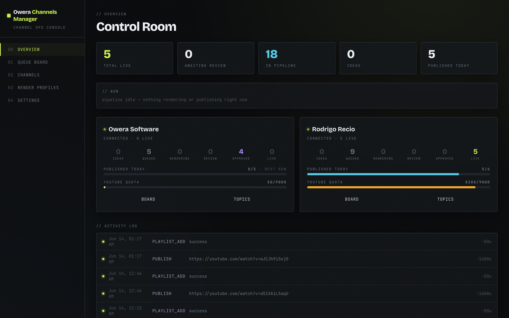
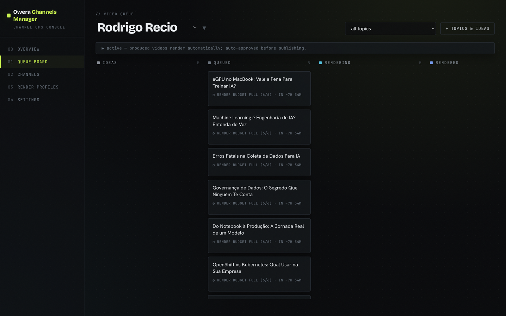
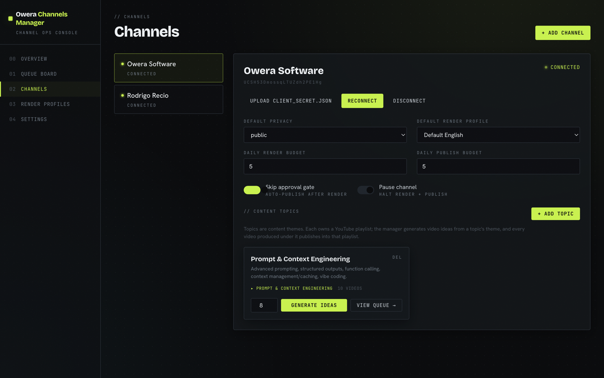
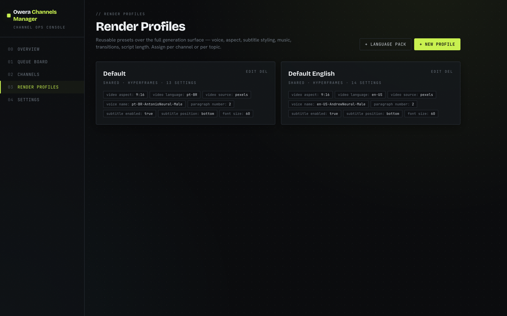

# Owera Channels Manager

[](LICENSE)


Run a fleet of faceless YouTube channels from a single dashboard. Owera Channels
Manager turns a list of topic ideas into finished, published Shorts: it writes the
scripts, renders the videos, optionally holds them for your approval, and uploads each
one into the right playlist on a schedule that respects YouTube's limits.

It's self-hosted and lightweight — one Python process, a single SQLite file, and a web
UI. You bring the Google accounts and an Anthropic API key; it handles the pipeline.



## Features

- **Many channels, one place** — manage every channel, its playlists, and its publishing
  cadence from the same board.
- **Idea → video, automatically** — give a topic a theme and it generates video ideas,
  then renders the ones you produce.
- **Two render engines** — **HyperFrames** (built in, no extra service to run) or
  **MoneyPrinterTurbo** (stock-footage clips with burned-in captions). Pick per render
  profile.
- **Reusable render profiles** — set aspect ratio, voice/language, captions, and music
  once, then reuse across topics and channels.
- **Approval gate (optional)** — review and tweak the title/description/tags before a
  video goes live, or flip on *skip gate* to auto-publish.
- **Quota-aware publishing** — per-channel daily budgets, drip-spacing between uploads,
  and automatic back-off when YouTube's daily limits are hit.

## How it works

```
Browser ──▶ Manager API + Web UI  (http://localhost:7000)
               │   SQLite (manager.db) — the single source of truth
               │   scheduler: render loop  +  publish loop
               ▼
         Render engine                       ──▶  YouTube Data API
         • HyperFrames (built in)                 uploads + playlists,
         • or MoneyPrinterTurbo (:8080)           one Google account per channel
```

The manager keeps everything in **`manager.db`** (channels, topics, render profiles,
videos and their status). A background **scheduler** does the work on a loop:

- **Render loop:** `queued → rendering → rendered → review | approved`
- **Publish loop:** `approved → publishing → published` (within your daily budget, drip-spaced)

The approval gate is just a status: a video in **review** won't publish until you approve
it. Turn on a channel's *skip gate* and rendered videos jump straight to **approved**.



## Requirements

- **Python 3.11–3.12** and [**uv**](https://docs.astral.sh/uv/) (manages the virtualenv for you)
- **Node 18+** (builds the web UI; also runs the HyperFrames renderer via `npx`)
- **ffmpeg** (used to grab video thumbnails)
- An **Anthropic API key** (powers script, title, and idea generation)
- For **each channel**: a Google Cloud project with the **YouTube Data API v3** enabled
  and an **OAuth Desktop client**. Use a separate project per channel so they don't share
  quota. You upload each `client_secret.json` from the UI — no config files to edit.

## Quick start

```sh
# 1. Add your Anthropic API key (kept local; .env is gitignored)
echo 'ANTHROPIC_API_KEY=sk-ant-...' > .env

# 2. Build the web UI
cd frontend && npm install && npm run build && cd ..

# 3. Start the manager (uv sets up the Python environment automatically)
uv run uvicorn app.main:app --port 7000
```

Open **http://localhost:7000** and you're in.

> **Developing the UI?** Run `cd frontend && npm run dev` for hot-reload (Vite on
> :5173, proxying `/api` to the manager on :7000).

### Optional: the MoneyPrinterTurbo engine

HyperFrames works out of the box. To also offer the stock-footage engine, clone
[MoneyPrinterTurbo](https://github.com/harry0703/MoneyPrinterTurbo) **next to this repo**
(as a sibling folder), configure its `config.toml` (Pexels keys, `llm_provider=litellm`),
and run it on port 8080:

```sh
cd ../MoneyPrinterTurbo && ANTHROPIC_API_KEY=… uv run uvicorn app.asgi:app --port 8080
```

Then choose **MoneyPrinterTurbo** as the engine on any render profile. (If it isn't
running, just use HyperFrames — nothing else is affected.)

## Using it

1. **Channels** → add a channel → upload its `client_secret.json` → **Connect**. A Google
   consent tab opens; once you approve, the channel title is captured.
2. **Render Profiles** → create a profile (aspect ratio, voice/language, caption style,
   music…) and set it as the channel default. Blank fields fall back to engine defaults.
3. **Channels** → create or sync the channel's **playlists** and pick defaults.
4. **Board** → add topics and bulk-add ideas → **produce** the ones you want and watch
   them flow `queued → rendering → rendered`. Each card shows what it's waiting on.
5. **Review** → preview a finished video, edit its title/description/tags/playlist, then
   **Approve** (or rely on the channel's *skip gate*).
6. The publish loop uploads each approved video within the daily budget and adds it to its
   playlist. Follow it all on the **Dashboard**.

<p align="center">
  
  
</p>

## Run it as a background service

Sample `systemd --user` units live in [`run/`](run/). Edit the `WorkingDirectory` (and the
`EnvironmentFile`/`mpt.service` lines if you're not using MoneyPrinterTurbo) to match your
checkout, then:

```sh
mkdir -p ~/.config/systemd/user
cp run/ytmanager.service ~/.config/systemd/user/      # + run/mpt.service if using MPT
systemctl --user daemon-reload
systemctl --user enable --now ytmanager.service
loginctl enable-linger "$USER"     # keep it running after you log out
```

## Tips & troubleshooting

- **Channel shows `expired`?** OAuth apps in "Testing" expire their refresh token about
  weekly. Click **Reconnect** in the UI to refresh it. Publishing the app's consent screen
  (moving it out of "Testing") stops the expiry.
- **Uploads paused for a while?** YouTube allows roughly 6 uploads/day per project, and
  brand-new or unverified channels are capped even lower. When a daily limit is hit, the
  channel backs off and retries after the limit resets — your approved videos stay queued,
  never lost. Verify the channel (youtube.com/verify) to lift the cap.
- **Videos stuck in `queued`?** That's the **daily render budget**. Each card shows the
  reason (e.g. *"render budget full (6/6) · in ~8h"*). Raise the channel's render budget to
  render more per day, or wait for the next reset.
- **Background music:** defaults to a random track from your own library. Don't point it at
  unlicensed music — YouTube's Content ID will catch it.
